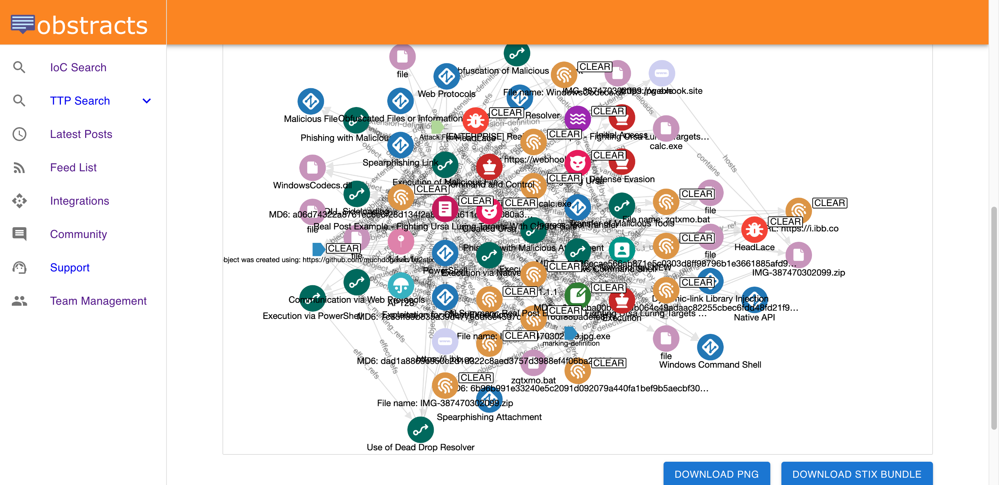

# Awesome Threat Intel Blogs

## About

A curated list of English language blogs with RSS or ATOM feeds posting cyber threat intelligence related content.

We built this during our research for [Obstracts, the blog feed reader for cyber-security teams](https://www.obstracts.com/), to create a list of high quality feeds we could subsribe to.

## Before you begin...

[Obstracts turns any blog into structured threat intelligence](https://www.obstracts.com/).

## GSheets Version

This list is now very long and the source data is managed in a GSheet.

[You can find a copy of the GSheet here for easier navigation](https://docs.google.com/spreadsheets/d/11ebsrFeCaoSup9V3n01tGw4h8vmlVhyQz0kn2EVHM-M/edit?usp=sharing).

## Subscribe for updates

To get automatically notified when this list is updated, [subscribe to email updates here](https://sibforms.com/serve/MUIFAPbIcZbrYijCOJgaFoAAIf_9FI_MADyWpfubzc9vyONMzq1dve8MYff2lZIG-LPFw9q4ug1BZJQNdtmVlUkD1rfGH-YXqasy1Pgip4L0yG9HgiLramJl3rkwMV4lWctzCT_sL4QZcOGSf0Gdit2C5_omYQdSxiNDriy7Z43aIrjnDo254VdhIoVauwJ-dd_GFBjArmZZMV5G).

## Contributing

Feel free to [contribute](CONTRIBUTING.md).

## License

[Creative Commons Attribution 4.0 International Public License](LICENSE).

## List of blogs

<table>
    <tr>
        <td>Name</td>
        <td>Type</td>
        <td>Blog</td>
        <td>Subscribe</td>
    </tr>
    <tr>
        <td>bellingcat</td>
        <td>Analyst</td>
        <td><a href='https://www.bellingcat.com/' target='_blank'>View blog</a></td>
        <td><a href='https://app.obstracts.com/feeds/9a864c33-78f8-518a-9396-50c7afe87bfb' target='_blank'>Subscribe to Feed</a></td>
    </tr>
    <tr>
        <td>Blaze's Security Blog</td>
        <td>Analyst</td>
        <td><a href='https://bartblaze.blogspot.com/' target='_blank'>View blog</a></td>
        <td><a href='https://app.obstracts.com/feeds/d3d91e94-d352-5d51-abc1-c2f7d0249949' target='_blank'>Subscribe to Feed</a></td>
    </tr>
    <tr>
        <td>BushidoToken Threat Intel</td>
        <td>Analyst</td>
        <td><a href='https://blog.bushidotoken.net/' target='_blank'>View blog</a></td>
        <td><a href='https://app.obstracts.com/feeds/' target='_blank'>Subscribe to Feed</a></td>
    </tr>
    <tr>
        <td>Center for Internet Security</td>
        <td>Analyst</td>
        <td><a href='https://www.cisecurity.org/insights/blog' target='_blank'>View blog</a></td>
        <td><a href='https://app.obstracts.com/feeds/13fd137d-8696-50c0-b49d-9da0aa73936a' target='_blank'>Subscribe to Feed</a></td>
    </tr>
    <tr>
        <td>Connof McGarr</td>
        <td>Analyst</td>
        <td><a href='https://connormcgarr.github.io/' target='_blank'>View blog</a></td>
        <td><a href='https://app.obstracts.com/feeds/c471de1b-328b-5e15-80d9-19e56af39136' target='_blank'>Subscribe to Feed</a></td>
    </tr>
    <tr>
        <td>Cyber Intelligence Insights</td>
        <td>Analyst</td>
        <td><a href='https://intelinsights.substack.com/' target='_blank'>View blog</a></td>
        <td><a href='https://app.obstracts.com/feeds/36351ee6-5bcb-583c-8799-7363674062c5' target='_blank'>Subscribe to Feed</a></td>
    </tr>
    <tr>
        <td>Cybercrime Diaries</td>
        <td>Analyst</td>
        <td><a href='https://www.cybercrimediaries.com/' target='_blank'>View blog</a></td>
        <td><a href='https://app.obstracts.com/feeds/a722b09d-c26f-5796-b1fc-223290e9229b' target='_blank'>Subscribe to Feed</a></td>
    </tr>
    <tr>
        <td>Darknet</td>
        <td>Analyst</td>
        <td><a href='https://www.darknet.org.uk/' target='_blank'>View blog</a></td>
        <td><a href='https://app.obstracts.com/feeds/' target='_blank'>Subscribe to Feed</a></td>
    </tr>
    <tr>
        <td>DataBreaches</td>
        <td>Analyst</td>
        <td><a href='https://databreaches.net/' target='_blank'>View blog</a></td>
        <td><a href='https://app.obstracts.com/feeds/' target='_blank'>Subscribe to Feed</a></td>
    </tr>
    <tr>
        <td>DoublePulsar (Kevin Beaumont)</td>
        <td>Analyst</td>
        <td><a href='https://doublepulsar.com/' target='_blank'>View blog</a></td>
        <td><a href='https://app.obstracts.com/feeds/cc0319ec-c46e-597d-ab3c-1f19ee3f8e1f' target='_blank'>Subscribe to Feed</a></td>
    </tr>
    <tr>
        <td>Krebs on Security</td>
        <td>Analyst</td>
        <td><a href='https://krebsonsecurity.com/' target='_blank'>View blog</a></td>
        <td><a href='https://app.obstracts.com/feeds/88aabe62-9341-563e-bf94-f272e79c2f5d' target='_blank'>Subscribe to Feed</a></td>
    </tr>
    <tr>
        <td>Lohrmann on Cybersecurity</td>
        <td>Analyst</td>
        <td><a href='https://www.govtech.com/blogs/lohrmann-on-cybersecurity' target='_blank'>View blog</a></td>
        <td><a href='https://app.obstracts.com/feeds/95411387-6c2f-5870-bd62-759c9fcc5c87' target='_blank'>Subscribe to Feed</a></td>
    </tr>
    <tr>
        <td>Raghavti Research</td>
        <td>Analyst</td>
        <td><a href='https://medium.com/@raghavtiresearch' target='_blank'>View blog</a></td>
        <td><a href='https://app.obstracts.com/feeds/' target='_blank'>Subscribe to Feed</a></td>
    </tr>
    <tr>
        <td>Schneier on Security</td>
        <td>Analyst</td>
        <td><a href='https://www.schneier.com/' target='_blank'>View blog</a></td>
        <td><a href='https://app.obstracts.com/feeds/96724ebc-9dec-5a63-8b2d-b3e7276a9064' target='_blank'>Subscribe to Feed</a></td>
    </tr>
    <tr>
        <td>The DFIR Report</td>
        <td>Analyst</td>
        <td><a href='https://thedfirreport.com/' target='_blank'>View blog</a></td>
        <td><a href='https://app.obstracts.com/feeds/38d6fa97-6639-537a-8421-99d62d7aa360' target='_blank'>Subscribe to Feed</a></td>
    </tr>
    <tr>
        <td>Troy Hunt</td>
        <td>Analyst</td>
        <td><a href='https://www.troyhunt.com' target='_blank'>View blog</a></td>
        <td><a href='https://app.obstracts.com/feeds/ded768f3-dd47-54e6-839e-db36ae73bfc7' target='_blank'>Subscribe to Feed</a></td>
    </tr>
    <tr>
        <td>Will's Root</td>
        <td>Analyst</td>
        <td><a href='https://www.willsroot.io/' target='_blank'>View blog</a></td>
        <td><a href='https://app.obstracts.com/feeds/' target='_blank'>Subscribe to Feed</a></td>
    </tr>
    <tr>
        <td>Citizen Lab</td>
        <td>Community</td>
        <td><a href='https://citizenlab.ca/' target='_blank'>View blog</a></td>
        <td><a href='https://app.obstracts.com/feeds/598155e0-fb62-5ff9-ba7a-53bce9f16f12' target='_blank'>Subscribe to Feed</a></td>
    </tr>
    <tr>
        <td>ISC Handler's Diary</td>
        <td>Community</td>
        <td><a href='https://isc.sans.edu/diary' target='_blank'>View blog</a></td>
        <td><a href='https://app.obstracts.com/feeds/d8fc01a8-3ac9-5b71-b7c5-0e5eac74e481' target='_blank'>Subscribe to Feed</a></td>
    </tr>
    <tr>
        <td>Open Source Malware</td>
        <td>Community</td>
        <td><a href='https://opensourcemalware.com/blog/' target='_blank'>View blog</a></td>
        <td><a href='https://app.obstracts.com/feeds/a33ff194-0219-5a2f-8d57-900cc8675349' target='_blank'>Subscribe to Feed</a></td>
    </tr>
    <tr>
        <td>Ransom-ISAC</td>
        <td>Community</td>
        <td><a href='https://ransom-isac.org/blog/' target='_blank'>View blog</a></td>
        <td><a href='https://app.obstracts.com/feeds/705d720a-c776-5b41-99dc-425bf6b836df' target='_blank'>Subscribe to Feed</a></td>
    </tr>
    <tr>
        <td>Cert Polska</td>
        <td>Government</td>
        <td><a href='https://cert.pl/en/' target='_blank'>View blog</a></td>
        <td><a href='https://app.obstracts.com/feeds/b6625523-00b1-5259-927a-38b57a25f5b6' target='_blank'>Subscribe to Feed</a></td>
    </tr>
    <tr>
        <td>CERT-FR MENACES ET INCIDENTS</td>
        <td>Government</td>
        <td><a href='https://www.cert.ssi.gouv.fr/cti/' target='_blank'>View blog</a></td>
        <td><a href='https://app.obstracts.com/feeds/' target='_blank'>Subscribe to Feed</a></td>
    </tr>
    <tr>
        <td>Der Ver­fas­sungs­schutz</td>
        <td>Government</td>
        <td><a href='https://www.verfassungsschutz.de/' target='_blank'>View blog</a></td>
        <td><a href='https://app.obstracts.com/feeds/' target='_blank'>Subscribe to Feed</a></td>
    </tr>
    <tr>
        <td>Government of Canada Alerts and Advisories</td>
        <td>Government</td>
        <td><a href='https://www.cyber.gc.ca/en' target='_blank'>View blog</a></td>
        <td><a href='https://app.obstracts.com/feeds/' target='_blank'>Subscribe to Feed</a></td>
    </tr>
    <tr>
        <td>JPCERT</td>
        <td>Government</td>
        <td><a href='https://blogs.jpcert.or.jp/en/' target='_blank'>View blog</a></td>
        <td><a href='https://app.obstracts.com/feeds/7511b6be-55b3-55a2-ba04-75949cfd847b' target='_blank'>Subscribe to Feed</a></td>
    </tr>
    <tr>
        <td>NCSC (UK)</td>
        <td>Government</td>
        <td><a href='https://www.ncsc.gov.uk/information/rss-feeds' target='_blank'>View blog</a></td>
        <td><a href='https://app.obstracts.com/feeds/b3b8fe84-3864-51d8-a9b6-b8b09724da94' target='_blank'>Subscribe to Feed</a></td>
    </tr>
    <tr>
        <td>US-Cert National Cyber Awareness System</td>
        <td>Government</td>
        <td><a href='https://us-cert.cisa.gov/ncas/alerts' target='_blank'>View blog</a></td>
        <td><a href='https://app.obstracts.com/feeds/' target='_blank'>Subscribe to Feed</a></td>
    </tr>
    <tr>
        <td>404 Media</td>
        <td>Media</td>
        <td><a href='https://www.404media.co/' target='_blank'>View blog</a></td>
        <td><a href='https://app.obstracts.com/feeds/' target='_blank'>Subscribe to Feed</a></td>
    </tr>
    <tr>
        <td>Ars Technica</td>
        <td>Media</td>
        <td><a href='https://arstechnica.com/tag/security/' target='_blank'>View blog</a></td>
        <td><a href='https://app.obstracts.com/feeds/e6d23c53-438e-5a34-a7b3-bb8dda4bf14d' target='_blank'>Subscribe to Feed</a></td>
    </tr>
    <tr>
        <td>BleepingComputer</td>
        <td>Media</td>
        <td><a href='https://www.bleepingcomputer.com/' target='_blank'>View blog</a></td>
        <td><a href='https://app.obstracts.com/feeds/' target='_blank'>Subscribe to Feed</a></td>
    </tr>
    <tr>
        <td>CIO Magazine</td>
        <td>Media</td>
        <td><a href='https://www.cio.com/security/' target='_blank'>View blog</a></td>
        <td><a href='https://app.obstracts.com/feeds/' target='_blank'>Subscribe to Feed</a></td>
    </tr>
    <tr>
        <td>Cyber Security News</td>
        <td>Media</td>
        <td><a href='https://cybersecuritynews.com/' target='_blank'>View blog</a></td>
        <td><a href='https://app.obstracts.com/feeds/1b99a0df-dc87-5c39-945e-e698b9b2ab0c' target='_blank'>Subscribe to Feed</a></td>
    </tr>
    <tr>
        <td>Cyberscoop</td>
        <td>Media</td>
        <td><a href='https://cyberscoop.com/' target='_blank'>View blog</a></td>
        <td><a href='https://app.obstracts.com/feeds/31496587-6853-5622-9c6d-6979a1ee0b6a' target='_blank'>Subscribe to Feed</a></td>
    </tr>
    <tr>
        <td>Dark Reading</td>
        <td>Media</td>
        <td><a href='https://www.darkreading.com/' target='_blank'>View blog</a></td>
        <td><a href='https://app.obstracts.com/feeds/87022879-e41b-5862-b894-d647c9d25b5e' target='_blank'>Subscribe to Feed</a></td>
    </tr>
    <tr>
        <td>GBHackers</td>
        <td>Media</td>
        <td><a href='https://gbhackers.com/' target='_blank'>View blog</a></td>
        <td><a href='https://app.obstracts.com/feeds/57db9278-026e-5389-b875-0a7aa44bc51f' target='_blank'>Subscribe to Feed</a></td>
    </tr>
    <tr>
        <td>GovInfoSecurity</td>
        <td>Media</td>
        <td><a href='https://www.govinfosecurity.com/' target='_blank'>View blog</a></td>
        <td><a href='https://app.obstracts.com/feeds/' target='_blank'>Subscribe to Feed</a></td>
    </tr>
    <tr>
        <td>Graham Cluley</td>
        <td>Media</td>
        <td><a href='https://www.grahamcluley.com/' target='_blank'>View blog</a></td>
        <td><a href='https://app.obstracts.com/feeds/846d036f-1472-5708-bb75-f6e3b95e350f' target='_blank'>Subscribe to Feed</a></td>
    </tr>
    <tr>
        <td>HACKMAGEDDON</td>
        <td>Media</td>
        <td><a href='http://www.hackmageddon.com/' target='_blank'>View blog</a></td>
        <td><a href='https://app.obstracts.com/feeds/97e7dcb3-bbe2-5ee3-888a-1b1fcf79b44c' target='_blank'>Subscribe to Feed</a></td>
    </tr>
    <tr>
        <td>HackRead</td>
        <td>Media</td>
        <td><a href='https://www.hackread.com/' target='_blank'>View blog</a></td>
        <td><a href='https://app.obstracts.com/feeds/b358368f-2eee-5ad2-bf16-a7fc369ebd50' target='_blank'>Subscribe to Feed</a></td>
    </tr>
    <tr>
        <td>Infosecurity Magazine</td>
        <td>Media</td>
        <td><a href='https://www.infosecurity-magazine.com/news' target='_blank'>View blog</a></td>
        <td><a href='https://app.obstracts.com/feeds/c4655597-67da-558b-b2c8-cf3f1c3ada4a' target='_blank'>Subscribe to Feed</a></td>
    </tr>
    <tr>
        <td>NextGov</td>
        <td>Media</td>
        <td><a href='https://www.nextgov.com/cybersecurity/' target='_blank'>View blog</a></td>
        <td><a href='https://app.obstracts.com/feeds/f8945fe2-4b76-533a-b037-8bc1ef1be42f' target='_blank'>Subscribe to Feed</a></td>
    </tr>
    <tr>
        <td>Security Affairs</td>
        <td>Media</td>
        <td><a href='http://securityaffairs.co' target='_blank'>View blog</a></td>
        <td><a href='https://app.obstracts.com/feeds/4591e57d-d939-5a9c-95b6-1894657d6f54' target='_blank'>Subscribe to Feed</a></td>
    </tr>
    <tr>
        <td>Security Boulevard</td>
        <td>Media</td>
        <td><a href='https://securityboulevard.com/' target='_blank'>View blog</a></td>
        <td><a href='https://app.obstracts.com/feeds/e53b1673-3130-5d49-a016-4daeafc08e48' target='_blank'>Subscribe to Feed</a></td>
    </tr>
    <tr>
        <td>Security Online</td>
        <td>Media</td>
        <td><a href='https://securityonline.info' target='_blank'>View blog</a></td>
        <td><a href='https://app.obstracts.com/feeds/6e3c7ff7-83ad-534b-98f2-f45ee0ed4bbb' target='_blank'>Subscribe to Feed</a></td>
    </tr>
    <tr>
        <td>SecurityWeek</td>
        <td>Media</td>
        <td><a href='https://www.securityweek.com/' target='_blank'>View blog</a></td>
        <td><a href='https://app.obstracts.com/feeds/43af7e0a-eb55-5794-9d9c-cf333b58c78e' target='_blank'>Subscribe to Feed</a></td>
    </tr>
    <tr>
        <td>TechCrunch</td>
        <td>Media</td>
        <td><a href='https://techcrunch.com/category/security/' target='_blank'>View blog</a></td>
        <td><a href='https://app.obstracts.com/feeds/f885f448-c6f5-577f-9cfd-e596bcac93ac' target='_blank'>Subscribe to Feed</a></td>
    </tr>
    <tr>
        <td>TechRepublic</td>
        <td>Media</td>
        <td><a href='https://www.techrepublic.com/topic/security/' target='_blank'>View blog</a></td>
        <td><a href='https://app.obstracts.com/feeds/4ab18ac6-63ad-58b3-ac47-7e79f573fa93' target='_blank'>Subscribe to Feed</a></td>
    </tr>
    <tr>
        <td>The Cyber Express</td>
        <td>Media</td>
        <td><a href='https://thecyberexpress.com/' target='_blank'>View blog</a></td>
        <td><a href='https://app.obstracts.com/feeds/ec29c08c-cc8e-510f-b29e-d8e22f360c29' target='_blank'>Subscribe to Feed</a></td>
    </tr>
    <tr>
        <td>The Cyber Wire</td>
        <td>Media</td>
        <td><a href='https://thecyberwire.com/' target='_blank'>View blog</a></td>
        <td><a href='https://app.obstracts.com/feeds/e2ed4d25-e8d7-560b-b56b-56c0b43e8f93' target='_blank'>Subscribe to Feed</a></td>
    </tr>
    <tr>
        <td>The Guardian</td>
        <td>Media</td>
        <td><a href='https://www.theguardian.com/technology/data-computer-security' target='_blank'>View blog</a></td>
        <td><a href='https://app.obstracts.com/feeds/b961f5c1-bf74-5d4f-8727-7508a84de413' target='_blank'>Subscribe to Feed</a></td>
    </tr>
    <tr>
        <td>The Hacker News</td>
        <td>Media</td>
        <td><a href='https://thehackernews.com/' target='_blank'>View blog</a></td>
        <td><a href='https://app.obstracts.com/feeds/fa8b6a49-416b-5e02-96d2-6e80c4becccd' target='_blank'>Subscribe to Feed</a></td>
    </tr>
    <tr>
        <td>The Register</td>
        <td>Media</td>
        <td><a href='https://www.theregister.com/security/' target='_blank'>View blog</a></td>
        <td><a href='https://app.obstracts.com/feeds/22a17e08-f7f0-5050-8272-bb110312dec9' target='_blank'>Subscribe to Feed</a></td>
    </tr>
    <tr>
        <td>The Security Ledger</td>
        <td>Media</td>
        <td><a href='https://securityledger.com/' target='_blank'>View blog</a></td>
        <td><a href='https://app.obstracts.com/feeds/' target='_blank'>Subscribe to Feed</a></td>
    </tr>
    <tr>
        <td>WIRED</td>
        <td>Media</td>
        <td><a href='https://www.wired.com/category/security/' target='_blank'>View blog</a></td>
        <td><a href='https://app.obstracts.com/feeds/bc3fa5cc-60da-594e-b884-c34f952dd11d' target='_blank'>Subscribe to Feed</a></td>
    </tr>
    <tr>
        <td>ZDNet</td>
        <td>Media</td>
        <td><a href='https://www.zdnet.com/topic/security/' target='_blank'>View blog</a></td>
        <td><a href='https://app.obstracts.com/feeds/7759be08-34bc-5e54-b446-f6ec22310a1c' target='_blank'>Subscribe to Feed</a></td>
    </tr>
    <tr>
        <td>Abstract Security</td>
        <td>Vendor</td>
        <td><a href='https://www.abstract.security/abstract-canvas#blog' target='_blank'>View blog</a></td>
        <td><a href='https://app.obstracts.com/feeds/28feba0b-dd20-5171-9018-e64f24c5c9e5' target='_blank'>Subscribe to Feed</a></td>
    </tr>
    <tr>
        <td>AhnLab Security Intelligence Center</td>
        <td>Vendor</td>
        <td><a href='https://asec.ahnlab.com/en/' target='_blank'>View blog</a></td>
        <td><a href='https://app.obstracts.com/feeds/629e5a81-266d-5029-8677-4ac64033e0c9' target='_blank'>Subscribe to Feed</a></td>
    </tr>
    <tr>
        <td>ANY.RUN</td>
        <td>Vendor</td>
        <td><a href='https://any.run/cybersecurity-blog/' target='_blank'>View blog</a></td>
        <td><a href='https://app.obstracts.com/feeds/e852a58d-0cc5-511e-9747-d977c991e50b' target='_blank'>Subscribe to Feed</a></td>
    </tr>
    <tr>
        <td>AquaSec</td>
        <td>Vendor</td>
        <td><a href='https://www.aquasec.com/blog/' target='_blank'>View blog</a></td>
        <td><a href='https://app.obstracts.com/feeds/' target='_blank'>Subscribe to Feed</a></td>
    </tr>
    <tr>
        <td>Arctic Wolf</td>
        <td>Vendor</td>
        <td><a href='https://arcticwolf.com/resources/blog/' target='_blank'>View blog</a></td>
        <td><a href='https://app.obstracts.com/feeds/' target='_blank'>Subscribe to Feed</a></td>
    </tr>
    <tr>
        <td>Aryaka</td>
        <td>Vendor</td>
        <td><a href='https://www.aryaka.com/blog/' target='_blank'>View blog</a></td>
        <td><a href='https://app.obstracts.com/feeds/' target='_blank'>Subscribe to Feed</a></td>
    </tr>
    <tr>
        <td>AWS Security</td>
        <td>Vendor</td>
        <td><a href='https://aws.amazon.com/blogs/security/' target='_blank'>View blog</a></td>
        <td><a href='https://app.obstracts.com/feeds/b03e785b-3e8c-5785-a1d4-957ba50c358e' target='_blank'>Subscribe to Feed</a></td>
    </tr>
    <tr>
        <td>Binary Defense</td>
        <td>Vendor</td>
        <td><a href='https://binarydefense.com/resources/blog/' target='_blank'>View blog</a></td>
        <td><a href='https://app.obstracts.com/feeds/' target='_blank'>Subscribe to Feed</a></td>
    </tr>
    <tr>
        <td>Bitdefender Labs</td>
        <td>Vendor</td>
        <td><a href='https://www.bitdefender.com/blog/labs/' target='_blank'>View blog</a></td>
        <td><a href='https://app.obstracts.com/feeds/ffdb0dc2-033c-56d9-af6c-409f2a448ba8' target='_blank'>Subscribe to Feed</a></td>
    </tr>
    <tr>
        <td>Bitsight</td>
        <td>Vendor</td>
        <td><a href='https://www.bitsight.com/blog' target='_blank'>View blog</a></td>
        <td><a href='https://app.obstracts.com/feeds/' target='_blank'>Subscribe to Feed</a></td>
    </tr>
    <tr>
        <td>Black Hills</td>
        <td>Vendor</td>
        <td><a href='https://www.blackhillsinfosec.com/blog/' target='_blank'>View blog</a></td>
        <td><a href='https://app.obstracts.com/feeds/3a9c272e-9082-557d-bcd3-4e51835cc5a5' target='_blank'>Subscribe to Feed</a></td>
    </tr>
    <tr>
        <td>Blue Voyant</td>
        <td>Vendor</td>
        <td><a href='https://www.bluevoyant.com/blog' target='_blank'>View blog</a></td>
        <td><a href='https://app.obstracts.com/feeds/' target='_blank'>Subscribe to Feed</a></td>
    </tr>
    <tr>
        <td>BRANDEFENSE Blog</td>
        <td>Vendor</td>
        <td><a href='https://brandefense.io/blog/' target='_blank'>View blog</a></td>
        <td><a href='https://app.obstracts.com/feeds/fab4a295-5944-5656-b2db-38a389883cd8' target='_blank'>Subscribe to Feed</a></td>
    </tr>
    <tr>
        <td>Center for Internet Security</td>
        <td>Vendor</td>
        <td><a href='https://www.cisecurity.org/advisory' target='_blank'>View blog</a></td>
        <td><a href='https://app.obstracts.com/feeds/27d3b422-d9c0-55c3-a6f8-d3bbd073d5a4' target='_blank'>Subscribe to Feed</a></td>
    </tr>
    <tr>
        <td>Certik</td>
        <td>Vendor</td>
        <td><a href='https://www.certik.com/resources' target='_blank'>View blog</a></td>
        <td><a href='https://app.obstracts.com/feeds/' target='_blank'>Subscribe to Feed</a></td>
    </tr>
    <tr>
        <td>Chainalysis</td>
        <td>Vendor</td>
        <td><a href='https://www.chainalysis.com/blog/' target='_blank'>View blog</a></td>
        <td><a href='https://app.obstracts.com/feeds/d98dfaeb-a78e-5b92-be20-f8e81b70958c' target='_blank'>Subscribe to Feed</a></td>
    </tr>
    <tr>
        <td>Checkmarx</td>
        <td>Vendor</td>
        <td><a href='https://checkmarx.com/zero' target='_blank'>View blog</a></td>
        <td><a href='https://app.obstracts.com/feeds/b3115d20-e056-572f-a664-55ab5bb316df' target='_blank'>Subscribe to Feed</a></td>
    </tr>
    <tr>
        <td>Checkpoint</td>
        <td>Vendor</td>
        <td><a href='https://research.checkpoint.com/' target='_blank'>View blog</a></td>
        <td><a href='https://app.obstracts.com/feeds/458b452f-36f9-5d9d-85c5-a3c4d87801bb' target='_blank'>Subscribe to Feed</a></td>
    </tr>
    <tr>
        <td>Cisco Talos Intelligence Group</td>
        <td>Vendor</td>
        <td><a href='https://blog.talosintelligence.com/' target='_blank'>View blog</a></td>
        <td><a href='https://app.obstracts.com/feeds/22bdb9b5-39e8-5994-8da9-62d9763af2f3' target='_blank'>Subscribe to Feed</a></td>
    </tr>
    <tr>
        <td>Claroty</td>
        <td>Vendor</td>
        <td><a href='https://claroty.com/blog' target='_blank'>View blog</a></td>
        <td><a href='https://app.obstracts.com/feeds/' target='_blank'>Subscribe to Feed</a></td>
    </tr>
    <tr>
        <td>Clearsky Security</td>
        <td>Vendor</td>
        <td><a href='https://www.clearskysec.com/blog/' target='_blank'>View blog</a></td>
        <td><a href='https://app.obstracts.com/feeds/' target='_blank'>Subscribe to Feed</a></td>
    </tr>
    <tr>
        <td>Cloudflare</td>
        <td>Vendor</td>
        <td><a href='https://blog.cloudflare.com/' target='_blank'>View blog</a></td>
        <td><a href='https://app.obstracts.com/feeds/aee1ee27-a4ba-526d-97e3-c955ffc172d9' target='_blank'>Subscribe to Feed</a></td>
    </tr>
    <tr>
        <td>CloudSEK</td>
        <td>Vendor</td>
        <td><a href='https://www.cloudsek.com/blog/' target='_blank'>View blog</a></td>
        <td><a href='https://app.obstracts.com/feeds/b5e5ee66-805b-57ee-98ef-1f82f724f068' target='_blank'>Subscribe to Feed</a></td>
    </tr>
    <tr>
        <td>Cofense Intelligence</td>
        <td>Vendor</td>
        <td><a href='https://cofense.com/blog/' target='_blank'>View blog</a></td>
        <td><a href='https://app.obstracts.com/feeds/f86cb4b1-ac01-5477-aca3-ad7ce649688f' target='_blank'>Subscribe to Feed</a></td>
    </tr>
    <tr>
        <td>Crowdstrike</td>
        <td>Vendor</td>
        <td><a href='https://www.crowdstrike.com/en-us/blog/' target='_blank'>View blog</a></td>
        <td><a href='https://app.obstracts.com/feeds/ecfdd2cb-9727-52c9-bf18-9266b2e2fd61' target='_blank'>Subscribe to Feed</a></td>
    </tr>
    <tr>
        <td>Cybereason</td>
        <td>Vendor</td>
        <td><a href='https://www.cybereason.com/blog' target='_blank'>View blog</a></td>
        <td><a href='https://app.obstracts.com/feeds/cb3ac1f4-f16e-5b02-9073-dad1bf8e3b41' target='_blank'>Subscribe to Feed</a></td>
    </tr>
    <tr>
        <td>Cyble</td>
        <td>Vendor</td>
        <td><a href='https://cyble.com/blog/' target='_blank'>View blog</a></td>
        <td><a href='https://app.obstracts.com/feeds/' target='_blank'>Subscribe to Feed</a></td>
    </tr>
    <tr>
        <td>Cyera</td>
        <td>Vendor</td>
        <td><a href='https://www.cyera.com/blog' target='_blank'>View blog</a></td>
        <td><a href='https://app.obstracts.com/feeds/' target='_blank'>Subscribe to Feed</a></td>
    </tr>
    <tr>
        <td>Datadog Security Labs</td>
        <td>Vendor</td>
        <td><a href='https://securitylabs.datadoghq.com/articles/' target='_blank'>View blog</a></td>
        <td><a href='https://app.obstracts.com/feeds/ac3b20b4-fc8f-5eaf-8f8b-3b269b43bea4' target='_blank'>Subscribe to Feed</a></td>
    </tr>
    <tr>
        <td>Deep Instinct</td>
        <td>Vendor</td>
        <td><a href='https://www.deepinstinct.com/blog/' target='_blank'>View blog</a></td>
        <td><a href='https://app.obstracts.com/feeds/' target='_blank'>Subscribe to Feed</a></td>
    </tr>
    <tr>
        <td>Doctor Web</td>
        <td>Vendor</td>
        <td><a href='https://news.drweb.com/all/?c=5' target='_blank'>View blog</a></td>
        <td><a href='https://app.obstracts.com/feeds/b703e6d4-ea0d-5c13-bf08-400a3d6f58bb' target='_blank'>Subscribe to Feed</a></td>
    </tr>
    <tr>
        <td>DomainTools</td>
        <td>Vendor</td>
        <td><a href='https://www.domaintools.com/resources/blog' target='_blank'>View blog</a></td>
        <td><a href='https://app.obstracts.com/feeds/862421e2-f001-5f42-8ca9-df40da4d1da7' target='_blank'>Subscribe to Feed</a></td>
    </tr>
    <tr>
        <td>Dragos</td>
        <td>Vendor</td>
        <td><a href='https://www.dragos.com/blog' target='_blank'>View blog</a></td>
        <td><a href='https://app.obstracts.com/feeds/' target='_blank'>Subscribe to Feed</a></td>
    </tr>
    <tr>
        <td>EclecticIQ</td>
        <td>Vendor</td>
        <td><a href='https://blog.eclecticiq.com/' target='_blank'>View blog</a></td>
        <td><a href='https://app.obstracts.com/feeds/536cbb24-aecc-5e80-ae56-dedf34ffc663' target='_blank'>Subscribe to Feed</a></td>
    </tr>
    <tr>
        <td>eCrime.ch</td>
        <td>Vendor</td>
        <td><a href='https://ecrime.ch/newsletter.php' target='_blank'>View blog</a></td>
        <td><a href='https://app.obstracts.com/feeds/' target='_blank'>Subscribe to Feed</a></td>
    </tr>
    <tr>
        <td>Elastic</td>
        <td>Vendor</td>
        <td><a href='https://www.elastic.co/security-labs' target='_blank'>View blog</a></td>
        <td><a href='https://app.obstracts.com/feeds/3b67b5ad-2c09-590d-9457-06e4d7970a2f' target='_blank'>Subscribe to Feed</a></td>
    </tr>
    <tr>
        <td>eSentire</td>
        <td>Vendor</td>
        <td><a href='https://www.esentire.com/blog/' target='_blank'>View blog</a></td>
        <td><a href='https://app.obstracts.com/feeds/' target='_blank'>Subscribe to Feed</a></td>
    </tr>
    <tr>
        <td>Expel</td>
        <td>Vendor</td>
        <td><a href='https://expel.com/blog/?category=threat-intel' target='_blank'>View blog</a></td>
        <td><a href='https://app.obstracts.com/feeds/' target='_blank'>Subscribe to Feed</a></td>
    </tr>
    <tr>
        <td>FalconForce</td>
        <td>Vendor</td>
        <td><a href='https://medium.com/falconforce' target='_blank'>View blog</a></td>
        <td><a href='https://app.obstracts.com/feeds/f6f7b0ad-905a-5dc9-b6b0-58781173a009' target='_blank'>Subscribe to Feed</a></td>
    </tr>
    <tr>
        <td>Fidelis Security</td>
        <td>Vendor</td>
        <td><a href='https://fidelissecurity.com/' target='_blank'>View blog</a></td>
        <td><a href='https://app.obstracts.com/feeds/4927e6d2-af44-5749-83bd-5c4b8b4088ef' target='_blank'>Subscribe to Feed</a></td>
    </tr>
    <tr>
        <td>Fortinet</td>
        <td>Vendor</td>
        <td><a href='https://www.fortinet.com/blog' target='_blank'>View blog</a></td>
        <td><a href='https://app.obstracts.com/feeds/8737c8f4-48ba-54e8-98a7-f4a0d03cc98d' target='_blank'>Subscribe to Feed</a></td>
    </tr>
    <tr>
        <td>Fox-IT International blog</td>
        <td>Vendor</td>
        <td><a href='https://blog.fox-it.com' target='_blank'>View blog</a></td>
        <td><a href='https://app.obstracts.com/feeds/' target='_blank'>Subscribe to Feed</a></td>
    </tr>
    <tr>
        <td>GitHub Security Lab Archives</td>
        <td>Vendor</td>
        <td><a href='https://github.blog/tag/github-security-lab/' target='_blank'>View blog</a></td>
        <td><a href='https://app.obstracts.com/feeds/9fc9a491-4d37-5eae-8ade-879f147f388f' target='_blank'>Subscribe to Feed</a></td>
    </tr>
    <tr>
        <td>Google Online Security</td>
        <td>Vendor</td>
        <td><a href='https://security.googleblog.com/' target='_blank'>View blog</a></td>
        <td><a href='https://app.obstracts.com/feeds/d951772a-cabf-5359-973d-c4d87b6706b1' target='_blank'>Subscribe to Feed</a></td>
    </tr>
    <tr>
        <td>Google Project Zero (Legacy)</td>
        <td>Vendor</td>
        <td><a href='https://googleprojectzero.blogspot.com/' target='_blank'>View blog</a></td>
        <td><a href='https://app.obstracts.com/feeds/3fef7083-300f-5beb-88de-4326f14e512d' target='_blank'>Subscribe to Feed</a></td>
    </tr>
    <tr>
        <td>Google Threat Analysis Group</td>
        <td>Vendor</td>
        <td><a href='https://blog.google/threat-analysis-group/' target='_blank'>View blog</a></td>
        <td><a href='https://app.obstracts.com/feeds/860e288b-9e83-5059-97e4-6a72743cc174' target='_blank'>Subscribe to Feed</a></td>
    </tr>
    <tr>
        <td>GreyNoise Labs</td>
        <td>Vendor</td>
        <td><a href='https://www.labs.greynoise.io/' target='_blank'>View blog</a></td>
        <td><a href='https://app.obstracts.com/feeds/8f90b2ac-3023-56a1-9bb8-389f970e8446' target='_blank'>Subscribe to Feed</a></td>
    </tr>
    <tr>
        <td>Group IB</td>
        <td>Vendor</td>
        <td><a href='https://www.group-ib.com/blog/' target='_blank'>View blog</a></td>
        <td><a href='https://app.obstracts.com/feeds/e2752d97-f092-56d6-9e7e-9a8ddb7c43f5' target='_blank'>Subscribe to Feed</a></td>
    </tr>
    <tr>
        <td>HackerOne</td>
        <td>Vendor</td>
        <td><a href='https://www.hackerone.com/blog' target='_blank'>View blog</a></td>
        <td><a href='https://app.obstracts.com/feeds/' target='_blank'>Subscribe to Feed</a></td>
    </tr>
    <tr>
        <td>Have I Been Pwned</td>
        <td>Vendor</td>
        <td><a href='https://haveibeenpwned.com/' target='_blank'>View blog</a></td>
        <td><a href='https://app.obstracts.com/feeds/' target='_blank'>Subscribe to Feed</a></td>
    </tr>
    <tr>
        <td>Heimdal</td>
        <td>Vendor</td>
        <td><a href='https://heimdalsecurity.com/blog/posts/' target='_blank'>View blog</a></td>
        <td><a href='https://app.obstracts.com/feeds/29f262a6-fa5b-5645-b135-4f174e949c83' target='_blank'>Subscribe to Feed</a></td>
    </tr>
    <tr>
        <td>Hunt.io</td>
        <td>Vendor</td>
        <td><a href='https://hunt.io/blog' target='_blank'>View blog</a></td>
        <td><a href='https://app.obstracts.com/feeds/' target='_blank'>Subscribe to Feed</a></td>
    </tr>
    <tr>
        <td>Huntress</td>
        <td>Vendor</td>
        <td><a href='https://www.huntress.com/blog' target='_blank'>View blog</a></td>
        <td><a href='https://app.obstracts.com/feeds/e1b4d979-e6a5-5eef-9f0d-273f751e82e1' target='_blank'>Subscribe to Feed</a></td>
    </tr>
    <tr>
        <td>IBM Security Intelligence</td>
        <td>Vendor</td>
        <td><a href='https://www.ibm.com/think/security' target='_blank'>View blog</a></td>
        <td><a href='https://app.obstracts.com/feeds/' target='_blank'>Subscribe to Feed</a></td>
    </tr>
    <tr>
        <td>Infoblox</td>
        <td>Vendor</td>
        <td><a href='https://www.infoblox.com/blog/' target='_blank'>View blog</a></td>
        <td><a href='https://app.obstracts.com/feeds/6d870df2-31c0-50b0-887f-b393ca26ce46' target='_blank'>Subscribe to Feed</a></td>
    </tr>
    <tr>
        <td>Infoblox Threat Intel</td>
        <td>Vendor</td>
        <td><a href='https://blogs.infoblox.com/category/cyber-threat-intelligence/' target='_blank'>View blog</a></td>
        <td><a href='https://app.obstracts.com/feeds/ca5a5d7c-5b69-538a-89e5-cad879478bfa' target='_blank'>Subscribe to Feed</a></td>
    </tr>
    <tr>
        <td>Infostealers by HudsonRock</td>
        <td>Vendor</td>
        <td><a href='https://www.infostealers.com/' target='_blank'>View blog</a></td>
        <td><a href='https://app.obstracts.com/feeds/03d30791-f7ea-5133-af31-c3f411dda35e' target='_blank'>Subscribe to Feed</a></td>
    </tr>
    <tr>
        <td>IntelEye</td>
        <td>Vendor</td>
        <td><a href='https://inteleye.io/blog' target='_blank'>View blog</a></td>
        <td><a href='https://app.obstracts.com/feeds/' target='_blank'>Subscribe to Feed</a></td>
    </tr>
    <tr>
        <td>Intezer</td>
        <td>Vendor</td>
        <td><a href='https://intezer.com/blog/' target='_blank'>View blog</a></td>
        <td><a href='https://app.obstracts.com/feeds/faed5cec-ed90-5576-9bb3-e8d79ae36f60' target='_blank'>Subscribe to Feed</a></td>
    </tr>
    <tr>
        <td>Intrinsec</td>
        <td>Vendor</td>
        <td><a href='https://www.intrinsec.com/blog/' target='_blank'>View blog</a></td>
        <td><a href='https://app.obstracts.com/feeds/' target='_blank'>Subscribe to Feed</a></td>
    </tr>
    <tr>
        <td>KnowBe4</td>
        <td>Vendor</td>
        <td><a href='https://blog.knowbe4.com/' target='_blank'>View blog</a></td>
        <td><a href='https://app.obstracts.com/feeds/757991e1-d72b-5103-ae15-dd4f1ab0b0f9' target='_blank'>Subscribe to Feed</a></td>
    </tr>
    <tr>
        <td>Lab52</td>
        <td>Vendor</td>
        <td><a href='https://lab52.io/' target='_blank'>View blog</a></td>
        <td><a href='https://app.obstracts.com/feeds/c8475a7c-76d0-5d36-b8ef-23f7c4b1834d' target='_blank'>Subscribe to Feed</a></td>
    </tr>
    <tr>
        <td>LevelBlue SpiderLabs Blog</td>
        <td>Vendor</td>
        <td><a href='https://levelblue.com/blogs/spiderlabs-blog' target='_blank'>View blog</a></td>
        <td><a href='https://app.obstracts.com/feeds/9f9267fd-0707-5078-b951-6540ac6dc523' target='_blank'>Subscribe to Feed</a></td>
    </tr>
    <tr>
        <td>Malwarebytes Labs</td>
        <td>Vendor</td>
        <td><a href='https://www.malwarebytes.com/blog' target='_blank'>View blog</a></td>
        <td><a href='https://app.obstracts.com/feeds/e2585a36-fa2a-5b70-8691-15e134e21136' target='_blank'>Subscribe to Feed</a></td>
    </tr>
    <tr>
        <td>McAfee Labs</td>
        <td>Vendor</td>
        <td><a href='https://www.mcafee.com/blogs/other-blogs/mcafee-labs/' target='_blank'>View blog</a></td>
        <td><a href='https://app.obstracts.com/feeds/33433351-37ad-572b-9da6-aabf61aac033' target='_blank'>Subscribe to Feed</a></td>
    </tr>
    <tr>
        <td>Microsoft Security Blog</td>
        <td>Vendor</td>
        <td><a href='https://www.microsoft.com/security/blog/' target='_blank'>View blog</a></td>
        <td><a href='https://app.obstracts.com/feeds/b951ba98-6659-5660-af1d-d9bce60a6749' target='_blank'>Subscribe to Feed</a></td>
    </tr>
    <tr>
        <td>Microsoft Security Response Center</td>
        <td>Vendor</td>
        <td><a href='https://www.microsoft.com/en-us/msrc/blog/' target='_blank'>View blog</a></td>
        <td><a href='https://app.obstracts.com/feeds/' target='_blank'>Subscribe to Feed</a></td>
    </tr>
    <tr>
        <td>Morphisec Breach Prevention Blog</td>
        <td>Vendor</td>
        <td><a href='https://blog.morphisec.com/' target='_blank'>View blog</a></td>
        <td><a href='https://app.obstracts.com/feeds/69bab78f-4b0f-583e-a80e-e69915141411' target='_blank'>Subscribe to Feed</a></td>
    </tr>
    <tr>
        <td>Nextron</td>
        <td>Vendor</td>
        <td><a href='https://www.nextron-systems.com/' target='_blank'>View blog</a></td>
        <td><a href='https://app.obstracts.com/feeds/176ad02e-d5f0-5e5a-b7df-259b5190370c' target='_blank'>Subscribe to Feed</a></td>
    </tr>
    <tr>
        <td>NVISO</td>
        <td>Vendor</td>
        <td><a href='https://blog.nviso.eu/' target='_blank'>View blog</a></td>
        <td><a href='https://app.obstracts.com/feeds/1c186273-7aa6-568a-a904-1d9d78341bef' target='_blank'>Subscribe to Feed</a></td>
    </tr>
    <tr>
        <td>Outpost24</td>
        <td>Vendor</td>
        <td><a href='https://outpost24.com/blog/' target='_blank'>View blog</a></td>
        <td><a href='https://app.obstracts.com/feeds/90e1dc62-4748-5787-9ac8-8e32f7753cff' target='_blank'>Subscribe to Feed</a></td>
    </tr>
    <tr>
        <td>PaloAlto Networks Unit 42</td>
        <td>Vendor</td>
        <td><a href='https://unit42.paloaltonetworks.com/' target='_blank'>View blog</a></td>
        <td><a href='https://app.obstracts.com/feeds/c8d50a5a-c805-599d-99ad-5b5f5e92b089' target='_blank'>Subscribe to Feed</a></td>
    </tr>
    <tr>
        <td>Proofpoint</td>
        <td>Vendor</td>
        <td><a href='https://www.proofpoint.com/uk/blog' target='_blank'>View blog</a></td>
        <td><a href='https://app.obstracts.com/feeds/141807a0-68dd-5588-a436-a7e3301825e6' target='_blank'>Subscribe to Feed</a></td>
    </tr>
    <tr>
        <td>Pulsedive</td>
        <td>Vendor</td>
        <td><a href='https://blog.pulsedive.com/' target='_blank'>View blog</a></td>
        <td><a href='https://app.obstracts.com/feeds/46f395e8-c6be-5b00-b1d1-0edc210a5bb2' target='_blank'>Subscribe to Feed</a></td>
    </tr>
    <tr>
        <td>Qualys Blog</td>
        <td>Vendor</td>
        <td><a href='https://blog.qualys.com/' target='_blank'>View blog</a></td>
        <td><a href='https://app.obstracts.com/feeds/238d9eda-62f4-519f-ad05-e8f31580e042' target='_blank'>Subscribe to Feed</a></td>
    </tr>
    <tr>
        <td>Recorded Future</td>
        <td>Vendor</td>
        <td><a href='https://www.recordedfuture.com/' target='_blank'>View blog</a></td>
        <td><a href='https://app.obstracts.com/feeds/998281d6-5554-5584-b147-ab8ae86b1fe2' target='_blank'>Subscribe to Feed</a></td>
    </tr>
    <tr>
        <td>Red Canary</td>
        <td>Vendor</td>
        <td><a href='https://redcanary.com/' target='_blank'>View blog</a></td>
        <td><a href='https://app.obstracts.com/feeds/38a0102d-9b27-5628-a502-b7c893263932' target='_blank'>Subscribe to Feed</a></td>
    </tr>
    <tr>
        <td>Reliaquest</td>
        <td>Vendor</td>
        <td><a href='https://reliaquest.com/blog/' target='_blank'>View blog</a></td>
        <td><a href='https://app.obstracts.com/feeds/' target='_blank'>Subscribe to Feed</a></td>
    </tr>
    <tr>
        <td>ReversingLabs</td>
        <td>Vendor</td>
        <td><a href='https://www.reversinglabs.com/blog' target='_blank'>View blog</a></td>
        <td><a href='https://app.obstracts.com/feeds/d727393e-7c81-5f2f-8605-9e9ed7523338' target='_blank'>Subscribe to Feed</a></td>
    </tr>
    <tr>
        <td>RST Cloud</td>
        <td>Vendor</td>
        <td><a href='https://medium.com/@rst_cloud' target='_blank'>View blog</a></td>
        <td><a href='https://app.obstracts.com/feeds/7e7ea9c7-6a5d-5c67-bdd1-46cd8aa2aa7e' target='_blank'>Subscribe to Feed</a></td>
    </tr>
    <tr>
        <td>RunZero</td>
        <td>Vendor</td>
        <td><a href='https://www.runzero.com/blog/' target='_blank'>View blog</a></td>
        <td><a href='https://app.obstracts.com/feeds/f01aba29-7d9d-5a8c-96d1-cdada497ab56' target='_blank'>Subscribe to Feed</a></td>
    </tr>
    <tr>
        <td>SecureList by Kaspersky</td>
        <td>Vendor</td>
        <td><a href='https://securelist.com/' target='_blank'>View blog</a></td>
        <td><a href='https://app.obstracts.com/feeds/7acde381-77f7-5839-9aa3-97396d60a4fa' target='_blank'>Subscribe to Feed</a></td>
    </tr>
    <tr>
        <td>Security Scorecard</td>
        <td>Vendor</td>
        <td><a href='https://securityscorecard.com/blog/' target='_blank'>View blog</a></td>
        <td><a href='https://app.obstracts.com/feeds/' target='_blank'>Subscribe to Feed</a></td>
    </tr>
    <tr>
        <td>security.com</td>
        <td>Vendor</td>
        <td><a href='https://www.security.com' target='_blank'>View blog</a></td>
        <td><a href='https://app.obstracts.com/feeds/be53b0e7-6fc4-5bbf-9e1f-d611b7578c9a' target='_blank'>Subscribe to Feed</a></td>
    </tr>
    <tr>
        <td>Sekoia</td>
        <td>Vendor</td>
        <td><a href='https://blog.sekoia.io/' target='_blank'>View blog</a></td>
        <td><a href='https://app.obstracts.com/feeds/ca02d40e-2389-51b4-b883-744c86e6736b' target='_blank'>Subscribe to Feed</a></td>
    </tr>
    <tr>
        <td>SensePost by Orange Cyberdefense</td>
        <td>Vendor</td>
        <td><a href='https://sensepost.com/blog' target='_blank'>View blog</a></td>
        <td><a href='https://app.obstracts.com/feeds/d18f9307-5e85-50d7-bf63-aaabcef8ebeb' target='_blank'>Subscribe to Feed</a></td>
    </tr>
    <tr>
        <td>SentinelOne</td>
        <td>Vendor</td>
        <td><a href='https://www.sentinelone.com/blog/' target='_blank'>View blog</a></td>
        <td><a href='https://app.obstracts.com/feeds/' target='_blank'>Subscribe to Feed</a></td>
    </tr>
    <tr>
        <td>SentinelOne Labs</td>
        <td>Vendor</td>
        <td><a href='https://www.sentinelone.com/labs/' target='_blank'>View blog</a></td>
        <td><a href='https://app.obstracts.com/feeds/28eb6b6f-d23b-5dcf-abba-061e586604c0' target='_blank'>Subscribe to Feed</a></td>
    </tr>
    <tr>
        <td>seqrite</td>
        <td>Vendor</td>
        <td><a href='https://www.seqrite.com/blog/' target='_blank'>View blog</a></td>
        <td><a href='https://app.obstracts.com/feeds/0ae1a2d3-32ce-5ecb-ac13-94a254d332a2' target='_blank'>Subscribe to Feed</a></td>
    </tr>
    <tr>
        <td>SOC Prime</td>
        <td>Vendor</td>
        <td><a href='https://socprime.com/blog/' target='_blank'>View blog</a></td>
        <td><a href='https://app.obstracts.com/feeds/a386702a-200f-5d8e-a45a-1a90d3aff4e9' target='_blank'>Subscribe to Feed</a></td>
    </tr>
    <tr>
        <td>SOC Radar</td>
        <td>Vendor</td>
        <td><a href='https://socradar.io/blog/' target='_blank'>View blog</a></td>
        <td><a href='https://app.obstracts.com/feeds/cb7f84f5-f21b-54ab-855e-579d8f3f3d40' target='_blank'>Subscribe to Feed</a></td>
    </tr>
    <tr>
        <td>Sophos</td>
        <td>Vendor</td>
        <td><a href='https://www.sophos.com/en-us/blog' target='_blank'>View blog</a></td>
        <td><a href='https://app.obstracts.com/feeds/' target='_blank'>Subscribe to Feed</a></td>
    </tr>
    <tr>
        <td>SpamHaus</td>
        <td>Vendor</td>
        <td><a href='https://www.spamhaus.org/resource-hub/feed' target='_blank'>View blog</a></td>
        <td><a href='https://app.obstracts.com/feeds/' target='_blank'>Subscribe to Feed</a></td>
    </tr>
    <tr>
        <td>SpecterOps Blog</td>
        <td>Vendor</td>
        <td><a href='https://posts.specterops.io/' target='_blank'>View blog</a></td>
        <td><a href='https://app.obstracts.com/feeds/' target='_blank'>Subscribe to Feed</a></td>
    </tr>
    <tr>
        <td>Sysdig</td>
        <td>Vendor</td>
        <td><a href='https://www.sysdig.com/blog' target='_blank'>View blog</a></td>
        <td><a href='https://app.obstracts.com/feeds/' target='_blank'>Subscribe to Feed</a></td>
    </tr>
    <tr>
        <td>Team Cymru</td>
        <td>Vendor</td>
        <td><a href='https://www.team-cymru.com/blog' target='_blank'>View blog</a></td>
        <td><a href='https://app.obstracts.com/feeds/' target='_blank'>Subscribe to Feed</a></td>
    </tr>
    <tr>
        <td>TeamT5</td>
        <td>Vendor</td>
        <td><a href='https://teamt5.org/en/blog/' target='_blank'>View blog</a></td>
        <td><a href='https://app.obstracts.com/feeds/86db00b4-9158-57ef-b75e-7e52b6249546' target='_blank'>Subscribe to Feed</a></td>
    </tr>
    <tr>
        <td>Tenable</td>
        <td>Vendor</td>
        <td><a href='https://www.tenable.com/blog/' target='_blank'>View blog</a></td>
        <td><a href='https://app.obstracts.com/feeds/264bd6da-f213-5f99-b669-213e5e2decf8' target='_blank'>Subscribe to Feed</a></td>
    </tr>
    <tr>
        <td>The Record</td>
        <td>Vendor</td>
        <td><a href='https://therecord.media/' target='_blank'>View blog</a></td>
        <td><a href='https://app.obstracts.com/feeds/15e73a26-b52e-593e-8670-bb0f2065901a' target='_blank'>Subscribe to Feed</a></td>
    </tr>
    <tr>
        <td>ThreatLocker</td>
        <td>Vendor</td>
        <td><a href='https://www.threatlocker.com/blog/' target='_blank'>View blog</a></td>
        <td><a href='https://app.obstracts.com/feeds/8d45e58f-561b-564e-b72e-7710085c92ea' target='_blank'>Subscribe to Feed</a></td>
    </tr>
    <tr>
        <td>Threatmon</td>
        <td>Vendor</td>
        <td><a href='https://threatmon.io/blog/' target='_blank'>View blog</a></td>
        <td><a href='https://app.obstracts.com/feeds/b25887f0-f0cd-5b4b-8c65-ffc0b6a32919' target='_blank'>Subscribe to Feed</a></td>
    </tr>
    <tr>
        <td>TrustedSec</td>
        <td>Vendor</td>
        <td><a href='https://trustedsec.com/blog' target='_blank'>View blog</a></td>
        <td><a href='https://app.obstracts.com/feeds/' target='_blank'>Subscribe to Feed</a></td>
    </tr>
    <tr>
        <td>UpGuard Blog</td>
        <td>Vendor</td>
        <td><a href='https://www.upguard.com/blog' target='_blank'>View blog</a></td>
        <td><a href='https://app.obstracts.com/feeds/af0b4e96-20c2-5f0e-b4c9-553cb523cce6' target='_blank'>Subscribe to Feed</a></td>
    </tr>
    <tr>
        <td>Validin</td>
        <td>Vendor</td>
        <td><a href='https://www.validin.com/blog/' target='_blank'>View blog</a></td>
        <td><a href='https://app.obstracts.com/feeds/' target='_blank'>Subscribe to Feed</a></td>
    </tr>
    <tr>
        <td>Vectra</td>
        <td>Vendor</td>
        <td><a href='https://www.vectra.ai/blog' target='_blank'>View blog</a></td>
        <td><a href='https://app.obstracts.com/feeds/' target='_blank'>Subscribe to Feed</a></td>
    </tr>
    <tr>
        <td>Virus Bulletin</td>
        <td>Vendor</td>
        <td><a href='https://www.virusbulletin.com/' target='_blank'>View blog</a></td>
        <td><a href='https://app.obstracts.com/feeds/' target='_blank'>Subscribe to Feed</a></td>
    </tr>
    <tr>
        <td>VirusTotal Blog</td>
        <td>Vendor</td>
        <td><a href='https://blog.virustotal.com/' target='_blank'>View blog</a></td>
        <td><a href='https://app.obstracts.com/feeds/b8c7bb8b-91b7-5ace-b8e5-98394c382ff4' target='_blank'>Subscribe to Feed</a></td>
    </tr>
    <tr>
        <td>Volexity</td>
        <td>Vendor</td>
        <td><a href='https://www.volexity.com/blog/' target='_blank'>View blog</a></td>
        <td><a href='https://app.obstracts.com/feeds/' target='_blank'>Subscribe to Feed</a></td>
    </tr>
    <tr>
        <td>WatchGuard Seplicity</td>
        <td>Vendor</td>
        <td><a href='https://www.watchguard.com/wgrd-security-hub/secplicity-blog/' target='_blank'>View blog</a></td>
        <td><a href='https://app.obstracts.com/feeds/ab8932b1-8e98-5bce-97bf-1de6731a8f7e' target='_blank'>Subscribe to Feed</a></td>
    </tr>
    <tr>
        <td>We Live Security by ESET</td>
        <td>Vendor</td>
        <td><a href='https://www.welivesecurity.com/en/about-eset-research' target='_blank'>View blog</a></td>
        <td><a href='https://app.obstracts.com/feeds/b2accc5c-7d5b-5c2f-9386-f4739ff140b8' target='_blank'>Subscribe to Feed</a></td>
    </tr>
    <tr>
        <td>WIZ Blog</td>
        <td>Vendor</td>
        <td><a href='https://www.wiz.io/blog' target='_blank'>View blog</a></td>
        <td><a href='https://app.obstracts.com/feeds/fffc6bd1-39d5-5880-bc08-09fac3aa910f' target='_blank'>Subscribe to Feed</a></td>
    </tr>
    <tr>
        <td>WIZ Cloud Threat Landscape</td>
        <td>Vendor</td>
        <td><a href='https://threats.wiz.io/' target='_blank'>View blog</a></td>
        <td><a href='https://app.obstracts.com/feeds/4da5a88c-35f6-5acd-8921-2a75ef66a358' target='_blank'>Subscribe to Feed</a></td>
    </tr>
    <tr>
        <td>Zero Day Initiative</td>
        <td>Vendor</td>
        <td><a href='https://www.zerodayinitiative.com/blog' target='_blank'>View blog</a></td>
        <td><a href='https://app.obstracts.com/feeds/d09f93f8-3031-5489-938a-2f6faf2eb313' target='_blank'>Subscribe to Feed</a></td>
    </tr>
    <tr>
        <td>Zimperium</td>
        <td>Vendor</td>
        <td><a href='https://www.zimperium.com/blog/' target='_blank'>View blog</a></td>
        <td><a href='https://app.obstracts.com/feeds/' target='_blank'>Subscribe to Feed</a></td>
    </tr>
    <tr>
        <td>ZScalar</td>
        <td>Vendor</td>
        <td><a href='https://www.zscaler.com/blogs' target='_blank'>View blog</a></td>
        <td><a href='https://app.obstracts.com/feeds/' target='_blank'>Subscribe to Feed</a></td>
    </tr>
    <tr>
        <td>NetSkope</td>
        <td>Vendor</td>
        <td><a href='https://www.netskope.com/resources' target='_blank'>View blog</a></td>
        <td><a href='https://app.obstracts.com/feeds/' target='_blank'>Subscribe to Feed</a></td>
    </tr>
</table>